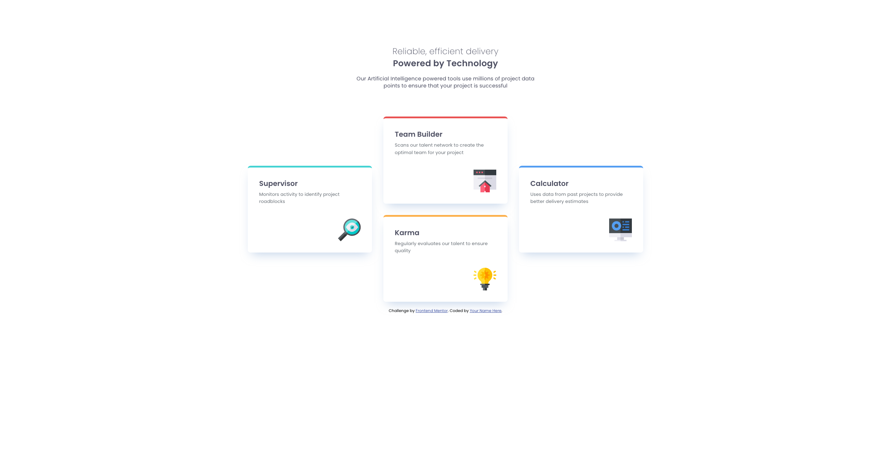

# Frontend Mentor - Four card feature section solution

This is a solution to the [Four card feature section challenge on Frontend Mentor](https://www.frontendmentor.io/challenges/four-card-feature-section-weK1eFYK). Frontend Mentor challenges help you improve your coding skills by building realistic projects. 

## Table of contents

- [Overview](#overview)
  - [The challenge](#the-challenge)
  - [Screenshot](#screenshot)
  - [Links](#links)
- [My process](#my-process)
  - [Built with](#built-with)
  - [What I learned](#what-i-learned)
  - [Continued development](#continued-development)

## Overview

### The challenge

Users should be able to:

- View the optimal layout for the site depending on their device's screen size

### Screenshot



### Links

- Solution URL: [Solution URL here](https://github.com/ZeroTekniq/Four-card-feature)
- Live Site URL: [Live site URL here](https://zerotekniq.github.io/Four-card-feature/)

## My process

### Built with

- Semantic HTML5 markup
- CSS custom properties
- Flexbox
- CSS Grid
- Mobile-first workflow
- [SASS](https://sass-lang.com/)

### What I learned

Now more comfortable with SASS and CSS grid. But still have lots to learn. Grid-template-areas is op and I love it!

To see how you can add code snippets, see below:

```css
@media (min-width: 1440px) {
        grid-template-columns: repeat(3, 1fr);
        grid-template-areas: ". b ." "a b d" "a c d" ". c .";
    }
    :nth-child(1) {
        grid-area: a;
    }
    :nth-child(2) {
        grid-area: b;
    }
    :nth-child(3) {
        grid-area: c;
    }
    :nth-child(4) {
        grid-area: d;
    }
```

### Continued development

Will continue to practice SASS and CSS grid to get more comfortable. Would like to start learning and practicing multipage sites.

## Author

- Website - [ZeroTekniq](https://github.com/ZeroTekniq/Four-card-feature)
- Frontend Mentor - [@ZeroTekniq](https://www.frontendmentor.io/profile/ZeroTekniq)

